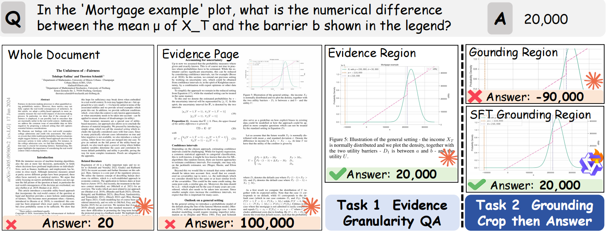

<p align="center">
  <h1 align="center">SciEGQA: A Dataset for Visual Evidence-Grounded Question Answering on Scientific Documents</h1>
  <p align="center">
    <a href="https://github.com/yuwenhan07"><strong>Wenhan Yu</strong></a>
    ·
    <a><strong>Zhaoxi Zhang</strong></a>
    ·
    <a><strong>Wang Chen</strong></a>
    ·
    <a><strong>Guanqiang Qi</strong></a>
    ·
    <a><strong>Weikang Li</strong></a>
    ·
    <a><strong>Lei Sha</strong></a>
    ·
    <a><strong>Deguo Xia</strong></a>
    ·
    <a><strong>Jizhou Huang</strong></a>
  </p>
  <p align="center">
    <a href="https://yuwenhan07.github.io/SciEGQA-project/">
      
      <strong> Project Page</strong>
    </a>
    ·
    🤗 <a href="https://huggingface.co/datasets/Yuwh07/SciEGQA-Bench"><strong> Benchmark Hugging Face</strong></a>
    🤗 <a href="https://huggingface.co/datasets/Yuwh07/SciEGQA-Train"><strong> Training Set Hugging Face</strong></a>
  </p>
</p>

SciEGQA focuses on a practical but under-explored setting: answering questions on scientific documents while explicitly grounding the answer in visual evidence regions. Each sample is paired with document metadata, evidence page indices, and bounding boxes that localize the supporting visual evidence, enabling both answer evaluation and grounding evaluation.

<p align="center">
  
</p>

## 💡 Highlights

- Visual evidence-grounded QA on scientific documents, rather than answer-only evaluation.
- Structured annotations including `query`, `answer`, `evidence_page`, `bbox`, `rel_bbox`, `subimg_type`, `doc_name`, and `category`.
- Multiple data views for experimentation, including page-level QA, crop-based QA, bbox prediction, and prediction-conditioned crop reconstruction.
- Support for both local generation and API-based generation.
- Support for both answer correctness judging and bounding-box IoU evaluation.
- Support Automatically generated training sets from PDFs.

<p align="center">
  
</p>

## 🛖 Repository Overview

This repository currently contains:

- `data/SciEGQA/`: demo-format converted datasets for different settings
- `data/SciEGQA-Bench/`: benchmark demo files and a link to the full benchmark release
- `Scripts/`: automatic training-set construction pipeline for PDF -> region -> QA data generation
- `generate/local_generate/`: local inference pipeline following the LlamaFactory multimodal data protocol
- `generate/api_generate/`: API-based multimodal inference with the official OpenAI API
- `metrics/`: IoU evaluation and answer correctness judging
- `asset/`: figures used in this README

## 📊 Data Format

SciEGQA samples are organized around visual evidence grounding. A typical record contains fields such as:

```json
{
  "query": "In the figure, which letter uniquely receives two arrows, and from which letters do they come?",
  "answer": "D; from C and E.",
  "doc_name": "2311.07631",
  "evidence_page": [4],
  "bbox": [[[281, 2228, 1890, 2941]]],
  "rel_bbox": [[[110.196078, 675.151515, 741.176471, 891.212121]]],
  "subimg_type": [["image"]],
  "category": "cs"
}
```

The converted datasets in `data/SciEGQA/` additionally follow the LlamaFactory multimodal protocol:

- `dataset_info.json`
- one dataset jsonl per setting
- `ShareGPT`-style samples with `messages` and `images`


## 📖 SciEGQA Datset Download

The repository includes a small demo version of `SciEGQA-Bench` under `data/SciEGQA-Bench/`.

For the complete SciEGQA dataset, please download it from Hugging Face:

- https://huggingface.co/datasets/Yuwh07/SciEGQA-Bench
- https://huggingface.co/datasets/Yuwh07/SciEGQA_Train

## 🛠️ Usage

### Requirements

```bash
pip install -r requirements.txt
```

### Workflows

This repository currently supports four main workflows:

1. Data conversion and local generation with the LlamaFactory-based pipeline in `generate/local_generate/`
2. API-based multimodal generation in `generate/api_generate/`
3. Output evaluation in `metrics/`
4. Automatic training-set construction from raw PDFs in `Scripts/`

Typical entry points:

```bash
# Automatic training-set construction
python Scripts/auto_train_pipeline.py run ...

# Local generation
python generate/local_generate/data_transfer.py ...
python generate/local_generate/generate_answers.py ...

# API generation
python generate/api_generate/generate_answer_api.py ...

# Evaluation
python metrics/IoU_compute.py ...
python metrics/Acc_judge.py ...
```

### Automatic Training-Set Construction

If you want to automatically construct the training set from raw PDFs, please refer to [Scripts/README.md](Scripts/README.md). It contains the recommended pipeline entry point, stage-by-stage commands, and the corresponding directory layout.

For detailed usage, arguments, and examples, please see the README files inside each folder:

- [Scripts/README.md](Scripts/README.md)
- [generate/local_generate/README.md](generate/local_generate/README.md)
- [generate/api_generate/README.md](generate/api_generate/README.md)
- [metrics/README.md](metrics/README.md)


## 📑 Evaluation

The repository currently supports two evaluation directions:

- Bounding-box grounding evaluation with `metrics/IoU_compute.py`
- Answer correctness judging with `metrics/Acc_judge.py`

See:

- [metrics/README.md](metrics/README.md)

<p align="center">
  
</p>

<p align="center">
  
</p>

## 📚 Intended Use

SciEGQA is intended for research on:

- visual evidence-grounded document question answering
- scientific document understanding
- multimodal retrieval and grounding
- answer-grounding consistency analysis
- pipeline evaluation for bbox-to-answer reasoning

## Citation

If you use SciEGQA Dataset in your research, please cite:

```bibtex
@misc{yu2026sciegqadatasetscientificevidencegrounded,
      title={SciEGQA: A Dataset for Scientific Evidence-Grounded Question Answering and Reasoning}, 
      author={Wenhan Yu and Zhaoxi Zhang and Wang Chen and Guanqiang Qi and Weikang Li and Lei Sha and Deguo Xia and Jizhou Huang},
      year={2026},
      eprint={2511.15090},
      archivePrefix={arXiv},
      primaryClass={cs.DB},
      url={https://arxiv.org/abs/2511.15090}, 
}
```